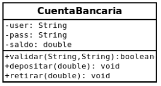
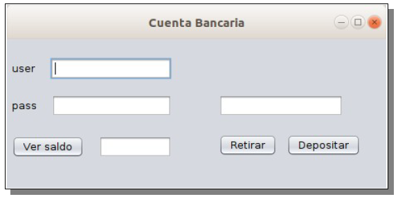

## Parte I: Capa lógica
 

Debe incluir atributos descritos, con los tipos correspondiente, así como sus getters y setters.
Agregar un constructor por defecto (sin parámetros), con las siguientes asignaciones:

#### user = "utu"
#### pass = "123"
#### saldo = 500

Agregar método toString que devuelva usuario y saldo.

**Para los métodos específicos se pide:**

• **public boolean validar(String u, String p)**: Recibe u y p que serán comparados con user y pass del objeto, en caso de que ambas sean correctas retorna  true, caso contrario retorna false.

• **public void depositar(double dinero)**: Recibe dinero que se quiere depositar, el cual modificará el valor de saldo. Si recibe un valor negativo de dinero, entonces el saldo queda sin modificar.

• **public double retirar(double dinero)**: Recibe dinero que se quiere retirar, el cual modificará el valor de saldo. Si recibe un valor negativo o el dinero a retirar es mayor al valor de saldo, entonces no debe realizar ninguna acción.

## Parte II: Capa gráfica

**Evento del botón [Ver saldo]**

• Se ingresa user y pass. Si coinciden con los del objeto (utu y 123 respectivamente) entonces muestra el saldo, caso contrario despliega “error”. Ambas salidas se realizan en el campo de texto ubicado a la derecha el botón.

**Evento del botón [Retirar]**

• Se ingresa un valor en el campo de texto ubicado arriba. Si se cumplen los requisitos,entonces disminuye el valor del saldo previamente visualizado.

**Evento del botón [Depositar]**

• Se ingresa un valor en el campo de texto ubicado arriba. Si se cumplen los requisitos, entonces aumenta el valor del saldo previamente visualizado.

